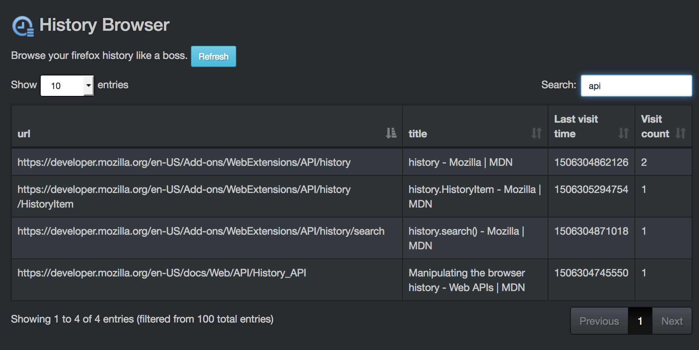

# WebExtensions History Browser [](https://travis-ci.org/GabLeRoux/webextensions-history-browser)


**Simple browser extension that helps you browse history like a boss.**

Firefox's default history sidebar is limited and the history browsing popup would benefit from some more features. It doesn't let you filter easily by date range as of September 2017. Other extensions that can do it aren't compatible with  **Firefox 57+** anymore, only work in firefox and/or aren't open source. This extension tries to solve all of this :rocket:

## Preview



## Key features

- [x] Search through **all** history
- [x] Search in date column
- [x] Sort columns

## TODO

- [ ] **Add a datetime picker range to filter by dates (library already installed)**
- [ ] Add a setting for the date format for `Last visit time` column
- [ ] Convert icon to svg (it's already a vector based icon in `resources`)
- [ ] Improve title search by using `browser.history` query
- [ ] Release on the firefox addons page
- [ ] Load all libraries from webpack with `require` instead of html tags
- [ ] Have webpack watch for `manifest.json` and use the [webpack-webext-plugin](https://github.com/rpl/webpack-webext-plugin) to simplify the workflow.
- [ ] Test on other browsers such as *Google Chrome* and *Microsoft Edge*
- [x] Format `Last visit time` column
- [x] Display history in a table
- [x] Sort history by date
- [x] Display number of visits per page
- [x] Add page title search
- [x] Create a logo
- [x] Install [bootstrap-daterangepicker](http://www.daterangepicker.com/)
- [x] Setup [datatables](https://datatables.net/) for minimal out of the box filtering and column sorting
- [x] Add some dark style using [bootswatch's slate bootstrap theme](https://bootswatch.com/slate/)
- [x] Create a basic table layout

## How to build it

```bash
npm install
npm run build
```

The WebExtension in the [addon](addon/) folder should now work.

## Live-development

Run `webpack` in **watch mode**. 

```bash
npm run watch
```

## Release

This will need some improvements, but here are the notes I took:

```bash
npm i && bower i
webpack -p
cd addon
zip -r webextensions-history-browser.zip ./*
```

## Contributions and Feature Requests

Sure can do! PRs are welcome :v:. Feel free to [open issues](https://github.com/GabLeRoux/webextensions-history-browser/issues).

## License

[MIT](LICENSE.md) © [Gabriel Le Breton](https://gableroux.com)
