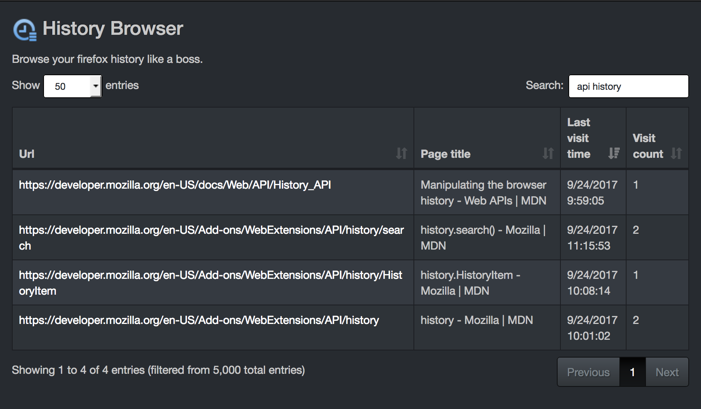

# WebExtensions History Browser [](https://travis-ci.org/GabLeRoux/webextensions-history-browser)


A simple firefox plugin that helps you browse your history because firefox default history browser doesn't let you filter or sort based on dates as of September 2017 and other extensions that can do it aren't compatible with Firefox anymore.

## Preview



## TODO

- [ ] Add a datetime picker range to filter by dates (library already installed)
- [ ] Add a setting for the date format for `Last visit time` column
- [ ] Convert icon to svg (it's already a vector based icon in `resources`)
- [ ] Add minification process to webpack config
- [ ] Improve title search by using `browser.history` query
- [ ] Release on the firefox addons page
- [ ] Load all libraries from webpack with `require` instead of html tags
- [x] Format `Last visit time` column
- [x] Display history in a table
- [x] Sort history by date
- [x] Display number of visits per page
- [x] Add page title search
- [x] Create a logo
- [x] Install [bootstrap-daterangepicker](http://www.daterangepicker.com/)
- [x] Run functions in `background.js` script
- [x] Setup [datatables](https://datatables.net/) for minimal out of the box filtering and column sorting
- [x] Add some dark style using [bootswatch's slate bootstrap theme](https://bootswatch.com/slate/)
- [x] Create a basic table layout

## How to build it

```bash
npm install
npm run build
```

The WebExtension in the [addon](addon/) folder should now work.

## TODO: Live-development

As well as watching the folder with your `manifest.json` in it, you will also have to run `webpack` in **watch mode**. You can use the [webpack-webext-plugin](https://github.com/rpl/webpack-webext-plugin) to simplify the workflow.

## License

[MIT](LICENSE.md) © [Gabriel Le Breton](https://gableroux.com)
